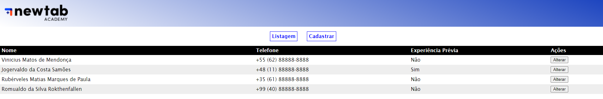

## Alguns aprendizados que obtive fazendo um pouco diferente do excelente *prof. Fernando Duro*:

No style.css, diminuí o tamanho da logo Newtab setando uma "max-width" específica.  

No input "telefone" (form.html), adicionei o atributo "pattern" para incluir um formato que precisa ser seguido para passar na validação do campo.  

* [Link para a página](https://vinnizius1.github.io/projeto_guiado-modulo_2/form.html)  

  

### Bóra evoluir! 🚀:books: 	:man_technologist:  :raised_hands:  
